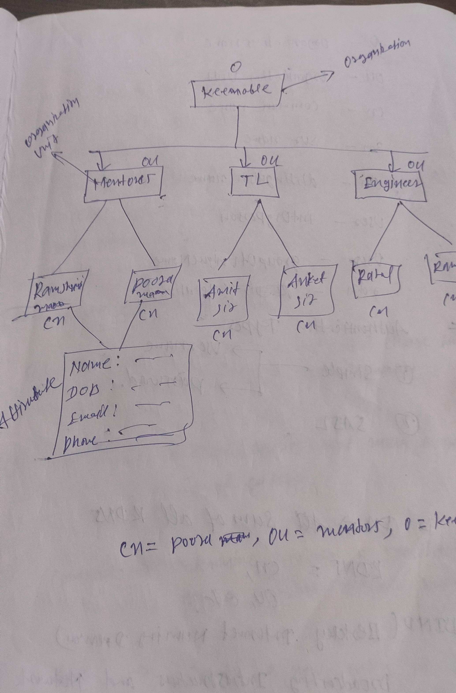

<div align="center">
 index 
</div>
- [What is ldap server](#What-is-ldap-server)

- [Ldap Operation types](#ldap-operation-types)

- [Ldap funcatons](#ldap-funcatons)

- [Here are the some keyword of ldap ](#here-are-the-some-keyword-of-ldap)

- [Types of authentication](#types-of-authentication)

- [Here are the Ldap commands](#here-are-the-ldap-commands)

- [Object class in ldap](#object-class-in-ldap)

- [Now, setup LDAP using podman container ubuntu 22.04](#now-setup-ldap-using-podman-container-ubuntu-2204)

- [Here, Example flow of keenable Organizational](#here-example-flow-of-keenable-organizational)

- [Types of object class](#types-of-object-class)

- [Now, Create the keenable Organizational enteris](#now-create-the-keenable-organizational-enteris)

- [ Now, setup ldap clinet](#now-setup-ldap-clinet)

 


## What is ldap server

<p>
Lightweight directory access protocol (LDAP)server, also called a Directory System Agent (DSA), runs on Windows OS and Unix/Linux. It stores usernames, passwords, and other core user identities. It uses this data to authenticate users when it receives requests or queries and shares the requests with other DSAs
</p>

## Ldap Operation types
<h4>Bind:</h3>
<li> 
Authenticate a user and change the identity of the client connection.
</li>

<h4>Search:</h3>
<li> 
Retrieve entries that match a given set of criteria.
</li>

<h4>Compare:</h3>
<li> 
 Determine whether a specified entry has a particular attribute value.
</li>

<h4>Add:</h3>
<li> 
  Create a new entry in the directory.
</li>


<h4>Delete:</h3>
<li> 
  Remove an entry from the directory.
  
</li>

 
<h4>Modify:</h3>
<li> 
  Alter the content of an entry in the directory.
  
</li>

<h4>Modify DN:</h3>
<li> 
  Change the DN of an entry in the directory.
  
</li>

<h4>Unbind :</h3>
<li> 
  Close the connection to the directory server.
</li>

<h4>Unbind :</h3>
<li> 
Request that the server stop processing a previously requested operation.
</li>

<h4>Extended :</h3>
<li> 
  Request some other type of processing that isn’t covered by one of the other operation types.
</li>


## Ldap funcatons 

<h4>For Authentication:</h4>

<li> Bind/Unbind</li> 
<li> Abandon </li>

<h4>For Query: </h4>
<li> Search <li> 
<li> compare Entry </li>

<h4>For Update: </h4>
<li> Add an Entry </li> 
<li> Modify an Entry </li>

 ## Here are the some keyword of ldap 

<li> DN: Distinguished Name</li>
<li> O : Organizational  </li>
<li> OU: Organizational Unit</li>
<li> CN: Common Name</li>
<li> SN: Sur Name </li>
<li> RDN: Relative Distinguished Name</li>

</ou>


## Types of authentication  
<li> Anonymous</li>
<li> Simple</li>
<li> SASL</li>
 

## Here are the Ldap commands.

<h4> <li> For the add Entery: </li> </h4>

```
# ldapadd -x -W -D "cn=ramesh,dc=keenable,dc=com" -f adam.ldif 

```

```
# ldapadd -a -c -xH ldap://localhost:3389 -D "cn=Directory Manager" -W -f admin.ldif 

```

<li> -x: It is use for simple authentication. </li>

<li> w-: It is use for the password of the users. </li>

<li> -D: It is use for distinguished name (DN). </li>

<li> -f: It is use for ldif file that contains the entries. </li>

<li> -a: It is use for add the entries form the ldif file to the directory </li>

<li> -c: It is use for  continues proccessing even if errores occur. If your entries are failed but entries are continues. </li>


<h4> <li> Assign password to LDAP user </li> </h4>

```
 ldappasswd -s rahul@123 -W -D "cn=rahul,dc=keenable,dc=com" -x "uid=10001,ou=users,dc=keen,dc=com"

```

<li> -s: It is use for set password of user</li>

<h4> <li> Add an user to an existing group using ldapmodify </li> </h4>

```
ldapmodify -x -W -D "cn=rahul,dc=keenable,dc=com" -f file1.ldif
 
```

<h4> <li> Delete an Entry from LDAP using ldapdelete </li> </h4>

```
ldapdelete -W -D "cn=rahul,dc=keenable,dc=com" "uid=1000,ou=users,dc=keenable,dc=com"

```

## Object class in ldap.
 
<p>Object class defines the collection of attributes that can be used to define an entry. The LDAP standard provides these basic types of object classes: Groups in the directory, including unordered lists of individual objects or groups of objects. Locations, such as the country name and description. </p>

## Types of object class.

<ol type="1"> 

<li > Structural Object Classes: </li>

<li> Auxiliary Object Classes: </li>

</ol>

 <h4> <li type="1"> Structural Object Classes: </li> </h4>

<li> inetOrgPerson </li>
<li> organizationalUnit </li>
<li> groupOfNames </li>

<h4> <li type="2"> Auxiliary Object Classes: </li> </h4>

<li> posixAccount </li>
<li> person </li>
<li> inetOrgPerson </li>


## Now, setup LDAP using podman container ubuntu 22.04 
```
# Install podman
sudo apt update && sudo apt upgrade -y

sudo apt install -y podman

podman --version 

```

```
# Setup Ldap 389

sudo mkdir ~/ldep/data

podman run -dt --name pfsense-ldap -p 3389:3389 -v ~/ldep/data:/data -e DS_SUFFIX_NAME=dc=keenable,dc=in -e DS_DM_PASSWORD=rahul quay.io/389ds/dirsrv

podman ps 

podman exec -it pfsense-ldap bash

# Check the suffix list
dsconf -D "cn=Directory Manager" ldap://localhost:3389 backend suffix list 

# Now, create the suffix keenable.
dsconf -D "cn=Directory Manager" ldap://localhost:3389 backend create --suffix "dc=keenable,dc=com" --be-name "keenable.com"

# Check the suffix list.
dsconf -D "cn=Directory Manager" ldap://localhost:3389 backend suffix list 


```

```
# Insall java jdk for access the Apache Directory

sudo apt-get -y install openjdk-17-jdk 

java -version

# Now, install Apache directory

https://directory.apache.org/apacheds/download/download-linux-deb.html 

```

## Here, Example flow of keenable Organizational.   




## Now, Create the keenable Organizational enteris 

```
# vim org.ldif 
dn: dc=keenable,dc=com
objectClass: top
objectClass: domain
dc: keenable

```
<h4> <li> Now add keenable organizational in ldap. </li> </h4>


```
ldapadd -a -c -xH ldap://localhost:3389 -D "cn=Directory Manager" -W -f org.ldif

```


<h4> <li> Now add Mentores group into the keenable organizational. </li> </h4>

```
dn: ou=Mentores, dc=keenable,dc=com
objectClass: top
objectClass: groupOfNames
cn: Mentores
Description: This groups are only for mentores members.

```

<h4> <li> Now add TL group into the keenable organizational. </li> </h4>

```
dn: ou=Mentores, dc=keenable,dc=com
objectClass: top
objectClass: groupOfNames
cn: TL
Description: This groups are only for TL members.

```

<h4> <li> Now add Engineers group into the keenable organizational. </li> </h4>

```
dn: ou=Mentores, dc=keenable,dc=com
objectClass: top
objectClass: groupOfNames
cn: Engineers
Description: This groups are only for Engineers members.

```


<h4> <li> Now add Users into the  Mentores group of keenable organizational. </li> </h4>

```
dn: uid=1000, ou=Mentores, dc=keenable,dc=com
objectClass: top
objectClass: inetOrgPerson
uid: 1000
userPassword: 12345
cn: Rashmi
sn: ma'am

```

```
dn: uid=1001, ou=Mentores, dc=keenable,dc=com
objectClass: top
objectClass: inetOrgPerson
uid: 1001
userPassword: 12345
cn: pooja
sn: ma'am

```

```
dn: uid=1002, ou=Mentores, dc=keenable,dc=com
objectClass: top
objectClass: inetOrgPerson
uid: 1001
userPassword: 12345
cn: Rajiv
sn: sir

```


<h4> <li> Now add  Users into the  TL group of keenable organizational. </li> </h4>

```
dn: uid=2001, ou=TL, dc=keenable,dc=com
objectClass: top
objectClass: inetOrgPerson
uid: 2001
userPassword: 12345
cn: Amit
sn: sir

```


```
dn: uid=2002, ou=TL, dc=keenable,dc=com
objectClass: top
objectClass: inetOrgPerson
uid: 2002
userPassword: 12345
cn: Arun
sn: sir

```


```
dn: uid=2003, ou=TL, dc=keenable,dc=com
objectClass: top
objectClass: inetOrgPerson
uid: 2003
userPassword: 12345
cn: Ankit
sn: sir

```

<h4> <li> Now add  Users into the  Engineers group of keenable organizational. </li> </h4>


```
dn: uid=3001, ou=Engineers, dc=keenable,dc=com
objectClass: top
objectClass: inetOrgPerson
uid: 3001
userPassword: 12345
cn: Ramesh
sn: Kumar

```


```
dn: uid=3002, ou=Engineers, dc=keenable,dc=com
objectClass: top
objectClass: inetOrgPerson
uid: 3002
userPassword: 12345
cn: Ram
sn: Kumar

```

```
dn: uid=3003, ou=Engineers, dc=keenable,dc=com
objectClass: top
objectClass: inetOrgPerson
uid: 3003
userPassword: 12345
cn: Ankur
sn: Kumar

```


## Now, setup ldap clinet.  

```
sudo apt update
sudo apt install libnss-ldapd ldap-utils

# Configure LDAP Client:
sudo dpkg-reconfigure libnss-ldapd 

# Configure Authentication Settings:
sudo vim /etc/nslcd.conf

uid nslcd
gid nslcd
uri ldap://xxxxxxxxxxxx
base dc=keenable,dc=com 

# Restart Services:
sudo systemctl restart nslcd
sudo systemctl restart nscd

# Configure PAM (Pluggable Authentication Modules):
sudo nano /etc/pam.d/common-auth

# Add the following line at the top of the file to enable LDAP authentication:
auth   sufficient    pam_ldap.so

# Edit the NSSwitch configuration file:
sudo nano /etc/nsswitch.conf

passwd:         compat ldap
group:          compat ldap
getent passwd

```
